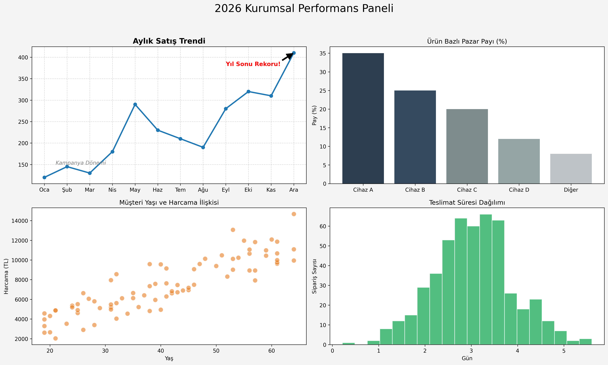

# 📊 Advanced Corporate Performance Dashboard
## Strategic Data Storytelling with Matplotlib

This project marks the transition from "simply plotting data" to **"telling a story through data."** It features a high-level corporate dashboard designed to provide executives with a clear, single-page view of business health.

---

## 🎯 Project Overview
In a corporate environment, leadership needs to understand trends, distributions, and correlations at a glance. This dashboard synthesizes multiple data sources into a unified, professional visual report using only **pure Matplotlib**.

### ✅ Technical Scope (Matplotlib Advanced)
- **Advanced Subplots:** Controlled a 2x2 grid layout using the Object-Oriented approach (`fig, ax`).
- **Visual Hierarchy:** Implemented consistent color palettes and font sizes for professional readability.
- **Data Storytelling:** Used **Annotations** and **Text** elements to highlight critical business events (e.g., "Year-End Record").
- **Customization:** Fine-tuned grids, backgrounds (`facecolor`), and layout padding (`tight_layout`).

---

## 🛠️ Dashboard Components
1. **Line Plot (Monthly Sales Trends):** Tracks performance over time with event annotations.
2. **Bar Plot (Product Market Share):** Comparative analysis of product line performance.
3. **Scatter Plot (Customer Behavior):** Correlation analysis between Customer Age and Spending habits.
4. **Histogram (Operational Efficiency):** Distribution of Delivery Times to measure logistics health.

---

## 🚀 Key Business Insights
- **Sales Trends:** Sales peaked in **Q4** due to successful marketing campaigns, hitting a record in December.
- **Market Share:** **Product B** is the market leader; strategic focus should remain on high-performing categories.
- **Customer Behavior:** There is a strong **positive correlation** between customer age and high-value spending.
- **Logistics:** Delivery performance is stable, clustering around the **3-day mark**, meeting corporate KPIs.

---

## 💻 Tech Stack
- **Python**
- **Matplotlib** (Advanced Customization)
- **NumPy** (Data Synthesis)

---

*Created by Dilara Akbaş - Feel free to connect on https://www.linkedin.com/in/dilara-akba%C5%9F-b468b2300/*
